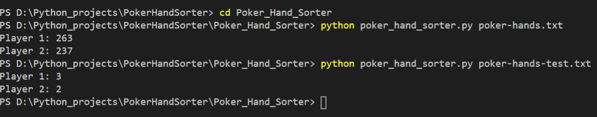
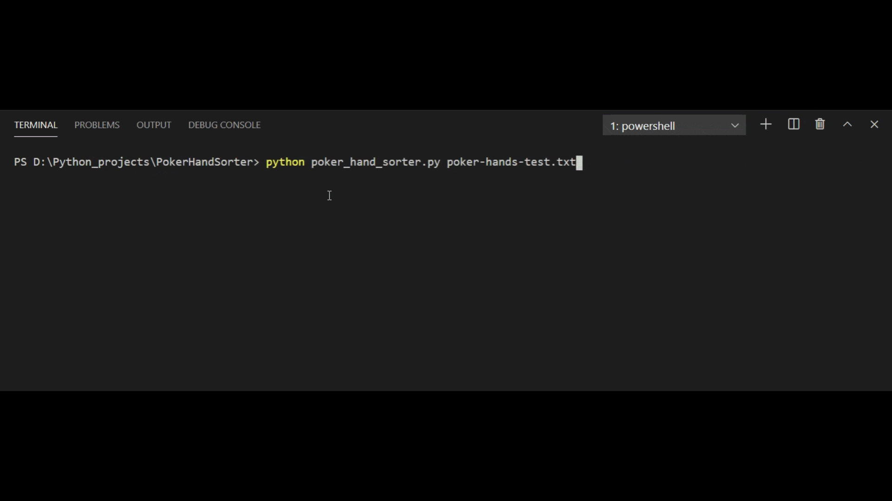

# PokerHandSorter
A Python code which decides poker game winner among two players by comparing combination of five playing cards of each player.

This problem is solved taking into consideration this [exercise pdf](./Poker_Exercise.pdf). For complete information of problem exercise, refer [exercise pdf](./Poker_Exercise.pdf).

## Usage

### Installing

In order to run this program, make sure that python is installed on your system.

### Folder structure

Here's a folder structure :

```
Poker_Hand_Sorter/        # Directory which contains code files.
|- poker-hands-test.txt   # A txt file to test our custom inputs.
|- poker-hands.txt        # The txt file which is given as input by the problem
|- poker_hand_sorter.py   # Entire code is present in this file
```

### How to Run?

```md
# Open the Command Prompt/Terminal
# Run the commands in the directory -> 'Poker_Hand_Sorter'
```

Use the below command to run this project:

```sh
python poker_hand_sorter.py poker-hands.txt
```

To test custom inputs, place those inputs in poker-hands-test.txt and run command:

```sh
python poker_hand_sorter.py poker-hands-test.txt
```


# Execution Screens

## Screenshot



## Execution in Action



# License

This project is licensed under [Apache License 2.0](./LICENSE)